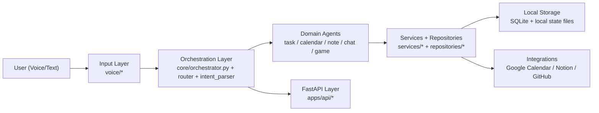

# vasya_ai

Local-first voice AI assistant for desktop productivity.

`vasya_ai` is a product-oriented assistant that helps manage tasks, events, notes, and integrations through voice and text, with local-first storage and optional external sync.

Current version: **0.6.0**

Language: **English** | [Русский](README.ru.md)

## Product Value
- Local-first workflow: core data stays on your machine (SQLite + local files)
- Voice-first UX with fast command loop
- Practical integrations: Google Calendar, Notion, GitHub
- API layer for future web/mobile clients (`FastAPI`)

## Use Cases
- Personal planner: add/list/complete tasks and schedule events by voice
- Daily assistant: morning briefing (weather + quote), reminders, quick notes
- Integration assistant: sync GitHub updates to Notion, export notes to Obsidian
- Memory assistant: search local Memory Center context and open matched files/URLs from desktop actions
- Automation sandbox: test local agent orchestration and routing policies

## Voice Typing
Vasya can send dictated text either to the currently focused field (OS actions) or to a custom HTTP API endpoint.

Examples:
- `Type text ...`
- `Add text ...`
- `Dictate ...`
- `Paste ...`
- `Start dictation mode`
- `Stop dictation mode`

Punctuation helpers in dictation mode:
- `comma`, `period`, `question mark`, `exclamation mark`
- `new line`

API dictation mode:
- Open `Settings -> Integrations -> Dictation mode`
- Select `Via API`
- Set `Dictation API URL` and optional token
- Vasya sends `POST` JSON payload: `{"text":"...","source":"vasya_dictation_mode"}`
- If token is set, `Authorization: Bearer ...` header is sent
- For safety, API dictation host is checked against `DICTATION_API_ALLOWED_HOSTS` (default: localhost only)

## Stack
- Python 3.11+
- FastAPI
- Ollama (local LLM)
- faster-whisper (STT)
- SQLite
- sounddevice + scipy

## Setup
Fast macOS path:
```bash
git clone https://github.com/xelvhk/vasya_ai.git
cd vasya_ai
bash scripts/setup_mac.sh
source .venv/bin/activate
ollama pull llama3
python scripts/doctor.py
python main.py
```

Manual path:
```bash
git clone https://github.com/xelvhk/vasya_ai.git
cd vasya_ai
python -m venv .venv
source .venv/bin/activate
pip install -r requirements.txt
cp .env.example .env
python scripts/doctor.py
python main.py
```

First-run checklist: [docs/FIRST_RUN.md](docs/FIRST_RUN.md)

Doctor flags:
```bash
python scripts/doctor.py --json
python scripts/doctor.py --strict
python scripts/doctor.py --quiet
```

TTS benchmark:
```bash
python scripts/benchmark_tts.py
python scripts/benchmark_tts.py --json
python scripts/benchmark_tts.py --include-heavy --save-artifacts
python scripts/benchmark_tts.py --include-experimental
python scripts/benchmark_tts.py --backend chatterbox --include-experimental --save-artifacts
```

The benchmark reports backend status, time-to-first-audio, total synthesis time, and failure/skip reasons for `say`, Piper, hybrid, and opt-in XTTS. Heavy or experimental engines stay opt-in; Chatterbox is available as an experimental multilingual quality candidate after `pip install chatterbox-tts`, and MisoTTS is tracked as a placeholder slot. Neither becomes the default assistant voice backend.

Optional API mode:
```bash
python -m uvicorn apps.api.main:app --host 127.0.0.1 --port 8787 --reload
```

API protection defaults:
- API key auth is required by default for `/v1/*` (`VASYA_API_REQUIRE_AUTH=true`)
- HTTP throttling is enabled for `/v1/chat` and `/v1/pipeline`
- WebSocket throttling is enabled for `/v1/ws/voice` (connection + message limits)

## Environment
Copy `.env.example` to `.env` and adjust values for your machine.

Key groups:
- LLM and voice: `OLLAMA_*`, `WHISPER_*`, `VOICE_*`
- UI and hotkeys: `HOTKEY_*`, `AVATAR_*`, `TTS_*`
- Integrations: `GOOGLE_CALENDAR_*`, `NOTION_*`, `GITHUB_*`
- API/security: `VASYA_API_AUTH_TOKEN`, `VASYA_API_REQUIRE_AUTH`, `VASYA_API_ALLOW_QUERY_TOKEN`, `LOG_*`, `DICTATION_API_ALLOWED_HOSTS`

Security note:
- Integration tokens from settings are stored in OS keyring when available.
- Legacy token fields are migrated out of `storage/integrations.json` on first read/write.

## Limitations / Responsible Use
- Vasya is a local productivity assistant, not a medical, legal, or emergency system.
- Voice recognition may be imperfect in noisy environments; verify important actions.
- OS-level actions can affect active applications; keep confirmations enabled for risky operations.
- External integrations (Google/Notion/GitHub) depend on your credentials, API limits, and network availability.
- Store and use personal/sensitive data according to your own security and compliance requirements.

## Architecture
```text
Input Layer
  voice/recorder.py, voice/stt.py, voice/pipeline.py

Orchestration Layer
  core/orchestrator.py, core/router.py, core/intent_parser.py

Domain Agents
  agents/task_agent.py, agents/calendar_agent.py, agents/note_agent.py, agents/chat_agent.py, agents/game_agent.py

Services + Repositories
  services/* + repositories/*

Storage + Integrations
  storage/vasya.db + external adapters (Google Calendar / Notion / GitHub)

API Layer
  apps/api/* (FastAPI endpoints for chat/tasks/events/notes)
```



## Demo / Screenshots
Current previews:

- Avatar widget concept  

- Source concept component: `examples/ui/vasya_ai_widget_concept.jsx` (prototype, not connected to runtime by default).

## Roadmap
Short roadmap:
- [ ] Stabilize voice quality profiles and recovery flow
- [ ] Add test coverage for critical services and routers
- [x] Improve onboarding script for zero-friction local setup
- [ ] Prepare API for web/mobile thin clients

Detailed roadmap and release timeline:
- [ROADMAP.md](ROADMAP.md)
- [docs/MOBILE_MONOREPO_PLAN.md](docs/MOBILE_MONOREPO_PLAN.md)
- [docs/RELEASE_NOTES.md](docs/RELEASE_NOTES.md)
- [docs/WHATS_NEW.md](docs/WHATS_NEW.md)
- [docs/SECURITY_ISSUES.md](docs/SECURITY_ISSUES.md)

## CI
CI is configured in `.github/workflows/ci.yml`:
- install dependencies
- run source syntax checks (`python -m compileall ...`)
- run the unit test suite
- run `python scripts/doctor.py --strict --quiet` as a first-run smoke gate

## Status
Active development

## License
GNU AGPLv3. See [LICENSE](LICENSE).
