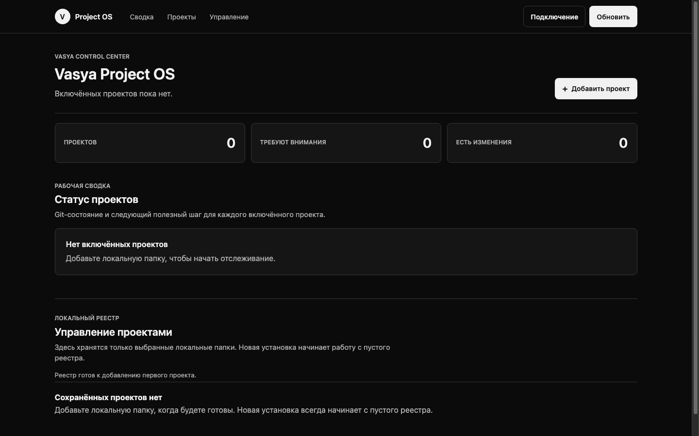
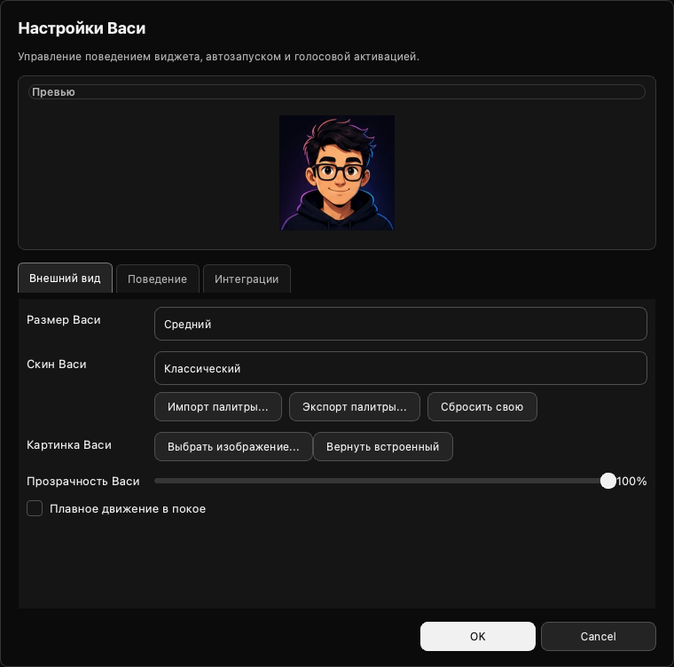

# Vasya AI

Local-first voice assistant and project control center for desktop.

Vasya combines a PySide desktop companion with **Vasya Project OS**, a browser-based
dashboard for local projects, tasks, status, and context. Core data stays on the
user's machine; external services are optional.

**Current tagged release:** `v0.6.0`

**Current development track:** `v0.7.0` macOS tester artifact

**Language:** English | [Русский](README.ru.md)

## Product preview

### Vasya Project OS



A fresh installation starts with an empty project registry. Vasya does not ship
with the maintainer's projects or local paths.

### Desktop assistant



The desktop shell provides the avatar, tray controls, global hotkeys, voice
activation, dictation, and local settings.

## What works today

- Voice and text commands for tasks, events, notes, and assistant chat.
- Local speech recognition, Ollama-based routing/chat, and configurable TTS.
- Desktop avatar states, tray menu, hotkeys, response bubbles, and settings.
- Morning Brief and local Memory Center search.
- Vasya Project OS with a user-owned project registry, Git status, and next-step
  summaries.
- Versioned backup preview and conflict-safe restore for non-secret user state.
- Optional Google Calendar, Notion, GitHub, and Obsidian integrations.
- A local FastAPI service for chat, tasks, events, notes, memory, and Project OS.
- A read-only connector contract and macOS EventKit availability foundation.

## Current boundaries

These capabilities are planned or still being completed:

- There is no signed or notarized DMG yet. The current macOS build is an unsigned
  tester ZIP.
- Eva ingestion through Apple Reminders and Calendar does not read records yet.
  Permission handling, selection, normalization, and sync remain in progress.
- Voice-triggered task creation in external systems, commits, and pushes are not
  enabled. Mutating agent actions will require an approval queue.
- Windows and Linux installers are not available.

See the [ordered execution plan](docs/EXECUTION_PLAN.md) for the exact current
slice and acceptance criteria.

## Quick start on macOS

Prerequisites: Python 3.11+, [Ollama](https://ollama.com/), and a working
microphone.

```bash
git clone https://github.com/xelvhk/vasya_ai.git
cd vasya_ai
bash scripts/setup_mac.sh
source .venv/bin/activate
ollama pull llama3
python scripts/doctor.py
python main.py
```

For a manual environment setup:

```bash
python -m venv .venv
source .venv/bin/activate
pip install -r requirements.txt
cp .env.example .env
python scripts/doctor.py
python main.py
```

The maintained first-run procedure is in
[docs/FIRST_RUN.md](docs/FIRST_RUN.md).

## Open Project OS

Start the local API:

```bash
source .venv/bin/activate
python -m uvicorn apps.api.main:app --host 127.0.0.1 --port 8787 --reload
```

Open [http://127.0.0.1:8787/control-center](http://127.0.0.1:8787/control-center).
API authentication is enabled by default. Use the **Connection** control with
the `VASYA_API_AUTH_TOKEN` from your local `.env`.

## Voice typing

Vasya can send dictated text to the active OS field or to an allowlisted HTTP
endpoint. Open **Settings > Integrations > Dictation mode** to choose the target.
API mode sends:

```json
{"text": "Your dictated text", "source": "vasya_dictation_mode"}
```

When configured, the token is sent as a Bearer token. API dictation is restricted
by `DICTATION_API_ALLOWED_HOSTS`, which defaults to localhost.

## Data and privacy

- Core records live in SQLite and local files under the platform app-data
  directory.
- A fresh profile contains no maintainer projects or paths.
- Integration secrets use the OS keyring when available and are excluded from
  backups.
- Model caches and large generated files are also excluded from user backups.
- External integrations run only when the user configures them.

Path layout, migration behavior, and backup scope are documented in
[docs/APP_DATA.md](docs/APP_DATA.md).

## Architecture

```text
Desktop UI                 Project OS
scripts/avatar_widget.py   apps/control_center/*
          \                  /
           apps/api/* (FastAPI)
                    |
       core orchestration and routing
                    |
             domain agents
                    |
       services and repositories
                    |
 local app data + optional external connectors
```

Primary technology:

- Python 3.11+ and PySide6
- FastAPI
- Ollama
- faster-whisper
- SQLite
- sounddevice and scipy

## macOS tester artifact

The repository can build an unsigned local `.app` and ZIP containing
`Vasya AI.app` plus `Vasya AI Doctor`:

```bash
.venv/bin/python -m pip install -r requirements-build.txt
.venv/bin/python scripts/build_macos_app.py
.venv/bin/python scripts/smoke_macos_app.py
.venv/bin/python scripts/build_macos_doctor.py
.venv/bin/python scripts/package_macos_app.py
.venv/bin/python scripts/smoke_macos_zip.py
.venv/bin/python scripts/smoke_macos_unpacked_zip.py
```

This is a tester artifact, not a public signed release. See
[docs/PACKAGING_PROTOTYPE.md](docs/PACKAGING_PROTOTYPE.md) and
[docs/PACKAGING_PLAN.md](docs/PACKAGING_PLAN.md).

## Configuration and security

Copy `.env.example` to `.env` and adjust only the integrations and local
runtime options you need.

Key groups:

- LLM and voice: `OLLAMA_*`, `WHISPER_*`, `VOICE_*`, `TTS_*`
- Desktop UI: `HOTKEY_*`, `AVATAR_*`
- Integrations: `GOOGLE_CALENDAR_*`, `NOTION_*`, `GITHUB_*`
- API: `VASYA_API_AUTH_TOKEN`, `VASYA_API_REQUIRE_AUTH`,
  `VASYA_API_ALLOW_QUERY_TOKEN`

The local API requires authentication for `/v1/*` by default and applies
rate limits to chat, pipeline, and voice WebSocket traffic.

## Documentation map

- [Execution plan](docs/EXECUTION_PLAN.md): the single ordered implementation queue.
- [Project OS plan](docs/PROJECT_OS_PLAN.md): dashboard and connector architecture.
- [Packaging plan](docs/PACKAGING_PLAN.md): installer and release milestones.
- [App-data guide](docs/APP_DATA.md): local storage and migration.
- [Release notes](docs/RELEASE_NOTES.md): current release-facing changes.
- [UI design system](docs/UI_DESIGN_SYSTEM.md): shared desktop and web UI rules.
- [Security issues](docs/SECURITY_ISSUES.md): known security work and mitigations.
- [Mac video note sync](docs/VIDEO_NOTE_SYNC_MAC.md): periodically save queued transcripts to Obsidian.
- [Product roadmap](ROADMAP.md): longer-term direction.

## Verification

```bash
COSYVOICE_PYTHON= .venv/bin/python -m unittest discover tests
.venv/bin/python -m compileall agents apps assistant config core interfaces repositories scripts services tests utils voice main.py
git diff --check
```

CI runs syntax checks, the unit suite, and the strict first-run doctor smoke.

## Responsible use

Vasya is a productivity assistant, not a medical, legal, or emergency system.
Review important voice-recognized actions, especially actions affecting other
applications or external services.

## License

GNU AGPLv3. See [LICENSE](LICENSE).
