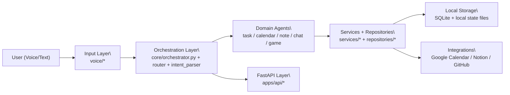

# vasya_ai

Локальный voice-first AI-ассистент для персональной продуктивности.

Язык: [English](README.md) | **Русский**

`vasya_ai` — продуктовый AI-ассистент, который помогает управлять задачами, событиями, заметками и интеграциями через голос и текст, с локальным хранением и опциональной внешней синхронизацией.

## Ценность продукта
- Local-first подход: базовые данные остаются на вашем устройстве (SQLite + локальные файлы)
- Voice-first UX с быстрым циклом команд
- Практичные интеграции: Google Calendar, Notion, GitHub
- API-слой для будущих web/mobile клиентов (`FastAPI`)

## Use Cases
- Личный планировщик: добавление/просмотр/закрытие задач и создание событий голосом
- Daily assistant: утренний брифинг (погода + мысль дня), напоминания, быстрые заметки
- Интеграционный помощник: синк обновлений GitHub в Notion, выгрузка заметок в Obsidian
- Automation sandbox: тестирование локальной оркестрации и routing policies

## Стек
- Python 3.11+
- FastAPI
- Ollama (локальная LLM)
- faster-whisper (STT)
- SQLite
- sounddevice + scipy

## Setup
```bash
git clone https://github.com/xelvhk/vasya_ai.git
cd vasya_ai
python -m venv .venv
source .venv/bin/activate
pip install -r requirements.txt
cp .env.example .env
python scripts/doctor.py
python main.py
```

Опциональный API-режим:
```bash
python -m uvicorn apps.api.main:app --host 127.0.0.1 --port 8787 --reload
```

## Environment
Скопируйте `.env.example` в `.env` и настройте переменные под свое окружение.

Ключевые группы:
- LLM и voice: `OLLAMA_*`, `WHISPER_*`, `VOICE_*`
- UI и hotkeys: `HOTKEY_*`, `AVATAR_*`, `TTS_*`
- Интеграции: `GOOGLE_CALENDAR_*`, `NOTION_*`, `GITHUB_*`
- API: `VASYA_API_AUTH_TOKEN`

## Архитектура
```text
Input Layer
  voice/recorder.py, voice/stt.py, voice/pipeline.py

Orchestration Layer
  core/orchestrator.py, core/router.py, core/intent_parser.py

Domain Agents
  agents/task_agent.py, agents/calendar_agent.py, agents/note_agent.py, agents/chat_agent.py, agents/game_agent.py

Services + Repositories
  services/* + repositories/*

Storage + Integrations
  storage/vasya.db + external adapters (Google Calendar / Notion / GitHub)

API Layer
  apps/api/* (FastAPI endpoints for chat/tasks/events/notes)
```



## Demo / Screenshots
Текущие превью:

- Avatar widget concept  


## Roadmap
Краткий roadmap:
- [ ] Стабилизировать voice quality profiles и recovery flow
- [ ] Увеличить test coverage для критичных сервисов и router
- [ ] Улучшить onboarding script для быстрого локального старта
- [ ] Подготовить API для web/mobile thin clients

Детальный roadmap и release timeline:
- [ROADMAP.md](ROADMAP.md)
- [docs/MOBILE_MONOREPO_PLAN.md](docs/MOBILE_MONOREPO_PLAN.md)
- [docs/RELEASE_NOTES.md](docs/RELEASE_NOTES.md)

## CI
Минимальный CI настроен в `.github/workflows/ci.yml`:
- установка зависимостей
- syntax check (`python -m compileall .`)

## Статус
Active development

## License
GNU AGPLv3. См. [LICENSE](LICENSE).
