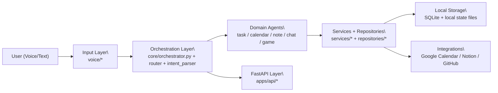
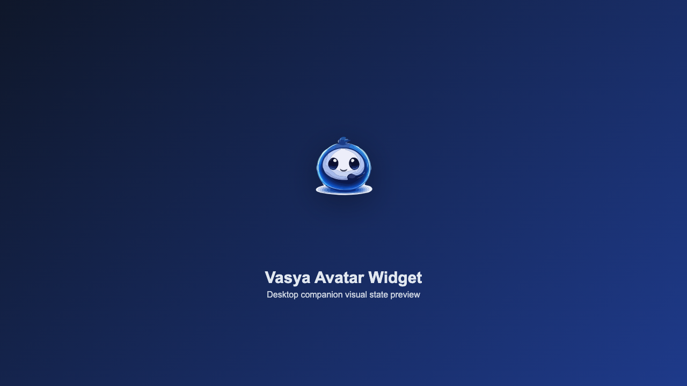

# vasya_ai

Локальный voice-first AI-ассистент для персональной продуктивности.

Язык: [English](README.md) | **Русский**

`vasya_ai` — продуктовый AI-ассистент, который помогает управлять задачами, событиями, заметками и интеграциями через голос и текст, с локальным хранением и опциональной внешней синхронизацией.

Текущая версия: `0.6.0`

## Обзор

Vasya уже умеет:
- принимать голосовой ввод локально
- распознавать речь локально
- разбирать интенты через локальную LLM в Ollama
- работать с задачами
- работать с календарем
- синхронизировать события с Google Calendar
- хранить данные в локальном SQLite
- озвучивать ответы через macOS `say`
- запускаться в фоне с hotkey
- показывать первый MVP плавающего аватара на рабочем столе
- управляться через tray или menu bar style control
- поддерживать более живой разговорный UX с follow-up и более быстрым chat path
- запускать детские голосовые игры через отдельный игровой агент
- хранить заметки локально и выгружать их в Obsidian
- использовать более быстрый и точный двухуровневый STT-контур
- поддерживать STT quality profiles и более умный recovery UX
- поддерживать встроенные скины Васи, импорт/экспорт палитры и пользовательские картинки аватара
- поддерживать tool registry с dispatch-маршрутизацией
- поддерживать routing policy layer в orchestrator
- поддерживать agent-to-agent handoff rules
- поддерживать unified local memory API (snapshot/search)
- поддерживать управляемую личную память пользователя (запомнить/забыть/показать) с локальным хранением
- поддерживать Notion adapter (чтение/запись) и синк последних GitHub-изменений в Notion
- поддерживать ускоренный conversational контур (quick chat profile + более короткая пауза follow-up)
- поддерживать метрики задержек голосового контура и команду отчета скорости
- поддерживать текстовое окно команд по hotkey для точных команд Notion/GitHub
- поддерживать голосовую команду для открытия текстового окна
- поддерживать утреннее шоу при первом обращении за день (погода + мысль дня)
- поддерживать API-шлюз для будущих mobile/web клиентов (`apps/api`)
- поддерживать Memory Center: локальные источники/чанки, поиск, recent view, daily digest, историю digest'ов и quick-open действия для найденных файлов/URL

Roadmap:
- см. [ROADMAP.md](ROADMAP.md)
- план мобильного monorepo: [docs/MOBILE_MONOREPO_PLAN.md](docs/MOBILE_MONOREPO_PLAN.md)
- security tracker: [docs/SECURITY_ISSUES.md](docs/SECURITY_ISSUES.md)

## Ценность продукта
- Local-first подход: базовые данные остаются на вашем устройстве (SQLite + локальные файлы)
- Voice-first UX с быстрым циклом команд
- Практичные интеграции: Google Calendar, Notion, GitHub
- API-слой для будущих web/mobile клиентов (`FastAPI`)

## Use Cases
- Личный планировщик: добавление/просмотр/закрытие задач и создание событий голосом
- Daily assistant: утренний брифинг (погода + мысль дня), напоминания, быстрые заметки
- Интеграционный помощник: синк обновлений GitHub в Notion, выгрузка заметок в Obsidian
- Memory assistant: поиск по локальному Memory Center и открытие найденных файлов/URL
- Automation sandbox: тестирование локальной оркестрации и routing policies

## Текущее MVP

Сейчас проект умеет:
- записывать звук с микрофона
- транскрибировать речь локально
- маршрутизировать команды в задачи и календарь
- разбирать частые русские фразы даты и времени
- создавать, показывать, отмечать выполненными и удалять задачи
- создавать, показывать и удалять события
- фильтровать задачи и события по дате
- хранить локальные данные в SQLite
- при необходимости синхронизировать календарные события с Google Calendar
- работать в desktop background и запускать голосовой цикл по горячей клавише
- показывать виджет-аватар с click-to-talk и индикацией состояний
- управляться через tray-иконку
- показывать более живые промежуточные статусы во время ответа
- удалять все задачи с голосовым подтверждением
- играть с ребенком в слова, прятки, загадки, угадай животное и повтори за мной
- персонализировать Васю через встроенные скины, свою палитру или свою картинку аватара
- управлять личной памятью голосом и очищать её из настроек с подтверждением
- синхронизировать последние изменения проекта из GitHub в Notion и добавлять записи в Notion голосом
- отвечать быстрее на короткие реплики за счет quick chat-профиля
- показывать разрез задержек голосового контура по команде
- выполнять текстовые команды через отдельное quick input-окно

Примеры команд:
- `Добавь задачу купить лампу`
- `Какие у меня задачи?`
- `Добавь встречу с Сашей завтра в 18:00`
- `Покажи события на 30 марта`
- `Синхронизируй GitHub в Notion`
- `Прочитай Notion`
- `Отчет скорости`
- `Найди в памяти архитектурное решение`
- `Последний дайджест памяти`
- `Cmd+Option+K` (открыть окно текстовой команды)
- `Замолчи`
- `Выход`

Голосовой ввод (в активное поле или через API):
- `Добавь текст ...`
- `Продиктуй ...`
- `Вставь ...`
- `Начни диктовку`
- `Стоп диктовка`

Пунктуация в режиме диктовки:
- `запятая`, `точка`, `вопросительный знак`, `восклицательный знак`
- `новая строка`, `новый абзац`

Режим диктовки через API:
- `Настройки -> Интеграции -> Режим диктовки -> Через API`
- указать `Dictation API URL` и при необходимости токен
- Вася отправляет `POST` JSON: `{"text":"...","source":"vasya_dictation_mode"}`
- при токене добавляет заголовок `Authorization: Bearer ...`
- для безопасности host проверяется по `DICTATION_API_ALLOWED_HOSTS` (по умолчанию только localhost)

## Стек
- Python 3.11+
- FastAPI
- Ollama (локальная LLM)
- faster-whisper (STT)
- SQLite
- sounddevice + scipy

## Setup
Быстрый путь на macOS:
```bash
git clone https://github.com/xelvhk/vasya_ai.git
cd vasya_ai
bash scripts/setup_mac.sh
source .venv/bin/activate
ollama pull llama3
python scripts/doctor.py
python main.py
```

Ручной путь:
```bash
git clone https://github.com/xelvhk/vasya_ai.git
cd vasya_ai
python -m venv .venv
source .venv/bin/activate
pip install -r requirements.txt
cp .env.example .env
python scripts/doctor.py
python main.py
```

First-run checklist: [docs/FIRST_RUN.md](docs/FIRST_RUN.md)

Опциональный API-режим:
```bash
python -m uvicorn apps.api.main:app --host 127.0.0.1 --port 8787 --reload
```

## Environment
Скопируйте `.env.example` в `.env` и настройте переменные под свое окружение.

Ключевые группы:
- LLM и voice: `OLLAMA_*`, `WHISPER_*`, `VOICE_*`
- UI и hotkeys: `HOTKEY_*`, `AVATAR_*`, `TTS_*`
- Интеграции: `GOOGLE_CALENDAR_*`, `NOTION_*`, `GITHUB_*`
- API: `VASYA_API_AUTH_TOKEN`

## Архитектура
```text
Input Layer
  voice/recorder.py, voice/stt.py, voice/pipeline.py

Orchestration Layer
  core/orchestrator.py, core/router.py, core/intent_parser.py

Domain Agents
  agents/task_agent.py, agents/calendar_agent.py, agents/note_agent.py, agents/chat_agent.py, agents/game_agent.py

Services + Repositories
  services/* + repositories/*

Storage + Integrations
  storage/vasya.db + external adapters (Google Calendar / Notion / GitHub)

API Layer
  apps/api/* (FastAPI endpoints for chat/tasks/events/notes)
```



## Demo / Screenshots
Текущие превью:

- Avatar widget concept


## Doctor CLI
Флаги диагностики:

```bash
python scripts/doctor.py --json
python scripts/doctor.py --strict
python scripts/doctor.py --quiet
```

## Roadmap
Краткий roadmap:
- [ ] Стабилизировать voice quality profiles и recovery flow
- [ ] Увеличить test coverage для критичных сервисов и router
- [x] Улучшить onboarding script для быстрого локального старта
- [ ] Подготовить API для web/mobile thin clients

Детальный roadmap и release timeline:
- [ROADMAP.md](ROADMAP.md)
- [docs/MOBILE_MONOREPO_PLAN.md](docs/MOBILE_MONOREPO_PLAN.md)
- [docs/RELEASE_NOTES.md](docs/RELEASE_NOTES.md)
- [docs/WHATS_NEW.md](docs/WHATS_NEW.md)

## CI
CI настроен в `.github/workflows/ci.yml`:
- установка зависимостей
- syntax check исходников (`python -m compileall ...`)
- запуск unit tests
- smoke gate первого запуска: `python scripts/doctor.py --strict --quiet`

## Статус
Active development

3. Установить зависимости

```bash
pip install -r requirements.txt
```

4. Установить Ollama и скачать модель

```bash
brew install ollama
ollama run llama3
```

Если Ollama уже установлена и модель доступна локально, этого достаточно.
При старте `main.py` приложение также пытается автоматически поднять `ollama serve`.

5. Запустить проект

Текстовая проверка:

```bash
python test_text.py
```

Desktop shell:

```bash
python main.py
```

Headless фоновый режим с горячей клавишей:

```bash
python scripts/hotkey_daemon.py
```

Desktop avatar widget MVP:

```bash
python scripts/avatar_widget.py
```

Что умеет:
- `python main.py` теперь запускает desktop shell
- левый клик запускает один голосовой цикл
- глобальная горячая клавиша тоже работает внутри процесса виджета
- перетаскивание двигает аватар по экрану
- клик по tray-иконке скрывает или показывает аватар
- автозапуск при входе в macOS можно включить из меню Васи или командой `python scripts/autostart_macos.py install`
- через tray-меню можно запустить listening или завершить Vasya
- через tray и меню аватара доступны настройки размера, позиции, hotkey и tray-click behavior
- по умолчанию Vasya использует встроенный процедурный живой аватар
- встроенные скины можно переключать прямо из настроек
- текущую палитру можно экспортировать в JSON и импортировать обратно как пользовательский скин
- свою картинку аватара в PNG, SVG, JPG, JPEG или WEBP теперь можно выбрать прямо из настроек
- в детском режиме Vasya может временно переключаться на детский скин и потом возвращаться к выбранному вручную
- `AVATAR_IMAGE_PATH` остается fallback-настройкой, если хочется заранее подложить картинку через окружение
- позиция виджета сохраняется между запусками
- рядом с аватаром показывается bubble во время listening, thinking, speaking и error
- правый клик открывает контекстное меню аватара

Текущий платформенный фокус:
- рабочий MVP сейчас ориентирован на macOS
- в дальнейшем планируется поддержка Windows и Linux

## Конфигурация

Основные настройки находятся в `config/settings.py`.

Пример:

```env
OLLAMA_URL=http://localhost:11434/api/generate
OLLAMA_MODEL=llama3
OLLAMA_FAST_MODEL=llama3
OLLAMA_REASONING_MODEL=llama3
OLLAMA_FAST_THINK=false
OLLAMA_FAST_TEMPERATURE=0.1
OLLAMA_FAST_NUM_PREDICT=256
OLLAMA_CHAT_NUM_PREDICT=160
OLLAMA_CHAT_QUICK_ENABLED=true
OLLAMA_CHAT_QUICK_MAX_WORDS=10
OLLAMA_CHAT_QUICK_NUM_PREDICT=96
OLLAMA_CHAT_QUICK_MODEL=fast
AUDIO_FILENAME=input.wav
RECORD_SECONDS=5
VOICE_ULTRA_FAST_MODE=true
VOICE_ULTRA_FAST_SKIP_CONFIRM_FOR_FAST_INTENTS=true
VOICE_ULTRA_FAST_MAX_RECORD_SECONDS=3.2
VOICE_SPEED_REPORT_WINDOW=30
VOICE_RUNTIME_PREWARM_ENABLED=true
VOICE_RUNTIME_PREWARM_ON_WIDGET_START=true
VOICE_RUNTIME_PREWARM_STT=true
VOICE_RUNTIME_PREWARM_OLLAMA=true
VOICE_RUNTIME_PREWARM_OLLAMA_CHAT=false
VOICE_RUNTIME_PREWARM_OLLAMA_TIMEOUT_SECONDS=7.0
VOICE_EARLY_FAST_IMMEDIATE_INTENTS=true
WHISPER_MODEL=base
WHISPER_PARTIAL_MODEL=base
WHISPER_FINAL_MODEL=large-v3-turbo
STT_PARTIAL_BEAM_SIZE=1
STT_FINAL_BEAM_SIZE=5

TTS_VOICE=Milena
TTS_RATE=185
TTS_BACKEND=auto
TTS_PROFILE=ruslan_direct
PIPER_COMMAND=piper
PIPER_MODEL_PATH=storage/voices/ru_RU-ruslan-medium.onnx
PIPER_SPEAKER=
PIPER_LENGTH_SCALE=1.0
XTTS_COMMAND=tts
XTTS_MODEL_NAME=tts_models/multilingual/multi-dataset/xtts_v2
XTTS_LANGUAGE=ru
XTTS_SPEAKER_WAV=
XTTS_SPEED=1.0
TTS_HYBRID_SHORT_TEXT_MAX_WORDS=6
TTS_STATE_FILE=storage/tts_settings.json
VOICE_INPUT_BACKEND=auto
HOTKEY_COMBINATION=<cmd>+<option>+<space>
HOTKEY_TEXT_COMBINATION=<cmd>+<option>+k
HOTKEY_EXIT_COMBINATION=<cmd>+<option>+q
INTERRUPT_LISTEN_DELAY_SECONDS=0.45
AVATAR_IMAGE_PATH=
AVATAR_SKIN=classic
AVATAR_PACK_SKINS=vasya_pro,vasya_pro_female
AVATAR_SIZE=210
AVATAR_STATE_FILE=storage/avatar_widget.json
AVATAR_CUSTOM_SKIN_FILE=storage/avatar_custom_skin.json

STORAGE_DB_FILE=storage/vasya.db
CALENDAR_STORAGE_FILE=storage/calendar.json
TASK_STORAGE_FILE=storage/tasks.json

GOOGLE_CALENDAR_ENABLED=false
GOOGLE_CALENDAR_CREDENTIALS_FILE=credentials.json
GOOGLE_CALENDAR_TOKEN_FILE=storage/google_token.json
GOOGLE_CALENDAR_ID=primary
GOOGLE_CALENDAR_TIMEZONE=Europe/Moscow
GOOGLE_CALENDAR_DEFAULT_EVENT_DURATION_MINUTES=60
GOOGLE_CALENDAR_SYNC_ON_READ=true
GOOGLE_CALENDAR_READ_MAX_RESULTS=20

NOTION_API_TOKEN=
NOTION_UPDATES_PAGE_ID=
GITHUB_API_TOKEN=
GITHUB_DEFAULT_REPO=owner/repo
GITHUB_SYNC_DEFAULT_HOURS=24
GITHUB_SYNC_STATE_FILE=storage/github_notion_sync_state.json
OBSIDIAN_VAULT_PATH=/абсолютный/путь/к/вашему/Obsidian/Vault
OBSIDIAN_EXPORT_NOTES_DIR=Vasya Inbox
OBSIDIAN_EDIT_NOTES_DIR=Vasya Inbox
OBSIDIAN_PROJECTS_DIR=Projects
OBSIDIAN_DAILY_NOTES_DIR=Daily
OBSIDIAN_DAILY_NOTES_DIRS=Daily,Ежедневные
TASKS_BACKEND=obsidian_daily

OS_ACTIONS_ENABLED=true
OS_ALLOWED_URL_DOMAINS=github.com,notion.so,obsidian.md,google.com,yandex.ru,openweathermap.org
OS_ALLOWED_APPS=Safari,Google Chrome,Firefox,Notion,Obsidian,Calendar,Notes,TextEdit,Terminal
OS_REQUIRE_CONFIRM_FOR_INPUT=true
OS_REQUIRE_CONFIRM_FOR_OPEN_EXTERNAL=false
AGENT_ROUTING_PROFILE=rolepack_v1
CHAT_PROMPT_PACK_PROFILE=dynamic_v1
MORNING_SHOW_ENABLED=true
MORNING_SHOW_CITY=Moscow
MORNING_SHOW_HOUR_LIMIT=12
MORNING_SHOW_PREWARM_ENABLED=true
MORNING_SHOW_WEATHER_CACHE_MINUTES=30
```

Для более быстрого intent parsing:
- `OLLAMA_FAST_MODEL` используется для коротких команд
- `OLLAMA_FAST_THINK=false` отключает reasoning на fast-path
- `OLLAMA_FAST_NUM_PREDICT` стоит держать небольшим, например `128` или `256`

Для более быстрого conversational ответа:
- `OLLAMA_CHAT_NUM_PREDICT=120..160` обычно достаточно
- `OLLAMA_CHAT_QUICK_ENABLED=true` включает быстрый профиль коротких реплик
- `OLLAMA_CHAT_QUICK_NUM_PREDICT=72..96` делает короткие ответы заметно быстрее
- `OLLAMA_CHAT_QUICK_MODEL=fast` использует fast-модель для коротких фраз
- `INTERRUPT_LISTEN_DELAY_SECONDS=0.35..0.5` ускоряет переход к следующей реплике
- `VOICE_ULTRA_FAST_MODE=true` включает более агрессивный fast voice-path
- `VOICE_ULTRA_FAST_SKIP_CONFIRM_FOR_FAST_INTENTS=true` снижает число лишних переспросов

Для более быстрого и точного распознавания речи:
- `WHISPER_PARTIAL_MODEL` можно оставить быстрым, например `base`
- `WHISPER_FINAL_MODEL` лучше поставить точнее, например `large-v3-turbo`
- `STT_PARTIAL_BEAM_SIZE=1` ускоряет промежуточное распознавание
- `STT_FINAL_BEAM_SIZE=5` оставляет качество на финальном распознавании

Выбор голоса:

```bash
python -m voice.tts --list-profiles
python -m voice.tts --list-voices
python -m voice.tts --profile ruslan_direct --text "Привет, это тест озвучки"
```

Benchmark TTS:

```bash
python scripts/benchmark_tts.py
python scripts/benchmark_tts.py --json
python scripts/benchmark_tts.py --include-heavy --save-artifacts
python scripts/benchmark_tts.py --include-experimental
python scripts/benchmark_tts.py --backend chatterbox --include-experimental --save-artifacts
python scripts/benchmark_tts.py --backend say --backend piper --backend chatterbox --backend cosyvoice --save-artifacts
```

Benchmark показывает статус backend, time-to-first-audio, total synthesis time и причины `SKIP`/`FAIL` для `say`, Piper, hybrid и opt-in XTTS. Тяжелые и experimental движки остаются opt-in; Chatterbox доступен как экспериментальный multilingual quality-candidate после `pip install chatterbox-tts`, CosyVoice можно измерять из локального clone `FunAudioLLM/CosyVoice` через `COSYVOICE_REPO_DIR` + `COSYVOICE_MODEL_DIR`, а MisoTTS учитывается как placeholder slot. Ни один из них не становится дефолтным голосом Васи.

Профили голоса:
- `ruslan_direct` — мужской, быстрый и прямой
- `alexa_natural_xtts` — женский, более натуральный XTTS-клон (нужен `XTTS_SPEAKER_WAV`)

Системные голосовые команды:
- `Замолчи`
- `Останови озвучивание`
- `Выход`
- `Закройся`

Голосовые OS-команды:
- `Открой сайт github.com`
- `Открой браузер`
- `Введи текст ...`
- `Добавь текст ...`
- `Продиктуй ...`
- `Вставь ...`
- `Нажми Enter`
- `Правый клик`
- `Прокрути вниз`

Голосовые команды Obsidian:
- `Добавь в обсидиан в заметку Проект Вася: обновить раздел установки`
- `Обнови заметку в обсидиан Roadmap: v0.6 фокус на Windows setup`
- `Добавь проект github owner/repo в обсидиан`

Managed Obsidian Vault (структура + шаблоны + плагины):
- создать управляемую структуру vault:
```bash
python scripts/obsidian_vault_bootstrap.py --vault "/path/to/Obsidian Vault"
```
- добавить рекомендуемые community plugins в `.obsidian/community-plugins.json`:
```bash
python scripts/obsidian_vault_bootstrap.py --vault "/Users/oksana/Documents/Obsidian Vault" --with-plugins
```
- построить индекс заметок (frontmatter + links) для проверки структуры:
```bash
python scripts/obsidian_vault_bootstrap.py --vault "/Users/oksana/Documents/Obsidian Vault" --index
```
- рекомендуемые плагины: `Dataview`, `Iconize`, `Templater`, `Tasks`, `Omnisearch`, `Juggl`, `Excalibrain`

Альтернативный путь для TTS:
- `say` пока остается самым простым встроенным вариантом для macOS
- `auto` использует `piper` для piper-профилей и может переключаться в `hybrid (XTTS + Piper)` для XTTS-профилей
- `piper` можно принудительно включить через `TTS_BACKEND=piper`
- `xtts` можно принудительно включить через `TTS_BACKEND=xtts`
- `hybrid` можно принудительно включить через `TTS_BACKEND=hybrid` (короткие реплики быстрее, длинные — натуральнее)
- для `piper` нужно как минимум указать `PIPER_MODEL_PATH`
- для XTTS нужно указать `XTTS_SPEAKER_WAV` (короткий чистый сэмпл голоса)
- при первой озвучке Vasya печатает, какой TTS backend реально используется
- для русской локальной озвучки можно скачать текущий голос так: `python scripts/setup_piper_ru.py --voices ruslan`

## Google Calendar

Настройка:
1. Создать Desktop App OAuth client в Google Cloud
2. Включить Google Calendar API
3. Сохранить credentials как `credentials.json` в корне проекта
4. Включить интеграцию через `.env`

Поведение:
- новые события могут отправляться в Google Calendar
- ближайшие события из Google Calendar могут импортироваться в SQLite
- если синхронизация с Google не удалась, Vasya продолжает работать локально и возвращает понятную ошибку

## Текущие ограничения

Это все еще MVP, поэтому ограничения пока такие:
- нет wake word
- нет режима постоянного прослушивания
- понимание речи все еще требует улучшения
- десктопный аватар пока это легкий первый виджет, а не полноценное desktop app
- пока нет menu bar приложения
- интеграция с Notion пока на уровне MVP и работы со страницей (не полный workspace sync)
- Obsidian пока только в режиме export, а не полного sync
- нет специализированных code и writing agents
- нет простой установки для Windows и Linux
- пока нет полноценной системы импортируемых character packs для Васи

## Путь по версиям

- `v0.3.x`: базовый voice MVP, локальное хранилище, задачи и календарь, Google Calendar, hotkey режим
- `v0.4.0`: первый desktop widget MVP с assistant state layer и click-to-talk аватаром
- `v0.4.1`: улучшенный conversational UX, voice confirmations, faster chat path, safer bulk task deletion
- `v0.4.2`: детский игровой режим и игровой агент
- `v0.4.3`: заметки, локальная память и Obsidian export
- `v0.4.4`: voice responsiveness, child-safe UX, улучшенный игровой flow
- `v0.4.5`: двухуровневый STT, STT quality profiles, smarter follow-up recovery, более понятные task/calendar clarifications
- `v0.4.6`: персонализация аватара, встроенные скины, импорт/экспорт палитры, свои картинки аватара и auto-switch детского скина
- `v0.4.7`: first-run onboarding, onboarding-диалог, чеклист и прогресс
- `v0.5.0`: polish desktop shell (hover tooltip, статус‑индикатор)
- `v0.5.1`: мини‑tooltip по состояниям
- `v0.5.2`: tool registry, routing policy layer, handoff rules и unified memory API
- `v0.5.3`: управляемая личная память пользователя, fast-path команды памяти и очистка личной памяти из настроек
- `v0.5.4`: Notion adapter (чтение/запись), синк GitHub -> Notion и fast voice intents для Notion-сценариев
- `v0.5.5`: ускоренный conversational loop (quick chat profile, меньше chat num_predict и короче follow-up delay)
- `v0.5.6`: voice latency метрики, команда `отчет скорости` и настройки ultra-fast voice режима
- `v0.5.7`: текстовое окно команд по hotkey, встроенное в desktop shell и общий роутер
- `v0.5.8`: голосовое открытие текстового окна, первое утреннее шоу за день и polish fast-lane маршрутизации
- `v0.5.9`: A/B-метрики голосового контура, адаптивные пороги auto-interrupt для тихой/шумной среды и live health-подсказка в hover/tray
- `v0.5.10`: базовый API-шлюз (`apps/api`) для будущих iOS/Android клиентов поверх общего core
- `v0.5.11`: слой context/action (контекст выделенного текста, screenshot-aware запросы, slash-style быстрые действия)
- `v0.5.12`: OS action tools с safety-политикой и role-spec маршрутизация с prompt packs (`default/work/concise/child`)
- `v0.5.13`: расширенные A/B voice метрики по routing/prompt профилям, распределению ролей, TTFR/TTA по профилям и покрытию local fast-lane
- `v0.5.14`: опциональный XTTS backend и гибридный режим (быстрые короткие реплики + более натуральные длинные)
- `v0.5.15`: runtime prewarm (STT/Ollama) и более агрессивный early fast-path для low-risk голосовых интентов
- `v0.5.16`: голосовые intents для обновления заметок Obsidian и синка GitHub проекта в Obsidian (структура из README)
- `v0.5.17`: мгновенный small-talk про погоду и предгенерация утреннего шоу (кеш до первого «доброе утро»)
- `v0.5.18`: streaming pipeline layer, WebSocket realtime режим, модульный реестр STT/TTS/LLM и benchmark harness
- `v0.5.19`: голосовая диктовка в активное поле (`os_type_text`) с fast RU-фразами (`добавь текст ...`, `продиктуй ...`, `вставь ...`)
- `v0.5.20`: режим непрерывной диктовки (`старт/стоп`), команды пунктуации и guardrails для безопасного ввода по фокусу
- `v0.5.21`: security hardening baseline: строгий API auth по умолчанию, keyring для токенов интеграций, log redaction и safer dictation API host allowlist
- `v0.5.22`: API/WS throttling layer для anti-abuse защиты
- `v0.5.23`: security test baseline для auth/throttling/log redaction
- `v0.5.24`: managed Obsidian vault bootstrap (папки `00..99`, шаблоны, frontmatter/link index, рекомендуемый plugin manifest)
- `v0.5.25`: Memory Center foundation: local memory sources/chunks, Markdown wiki artifacts, sync-state tracking и `/v1/memory/status`
- `v0.5.26`: GitHub/Notion/Obsidian sync в Memory Center через `/v1/memory/sync`
- `v0.5.27`: desktop Memory Center controls: status и manual sync из avatar/tray меню
- `v0.5.28`: background Memory Center scheduler
- `v0.5.29`: Memory Center search endpoint с локальным provenance-backed retrieval
- `v0.5.30`: desktop Memory Center search action
- `v0.5.31`: voice/text команды для Memory Center status, sync и search
- `v0.5.32`: Memory Center recent view и команды "что нового в памяти"
- `v0.5.33`: desktop Memory Center recent action
- `v0.5.34`: deterministic Memory Center daily digest artifacts и `/v1/memory/digest`
- `v0.5.35`: desktop Memory Center daily digest action
- `v0.5.36`: digest history через `/v1/memory/digests`, desktop action и fast command
- `v0.5.37`: desktop action to open latest Memory digest
- `v0.5.38`: digest history date range filters
- `v0.5.39`: digest history presets `range=7d|30d`
- `v0.5.40`: desktop digest history presets 7d/30d
- `v0.5.41`: desktop digest history day presets today/yesterday
- `v0.5.42`: desktop open-digest day actions
- `v0.5.43`: API day presets `range=today|yesterday`
- `v0.5.44`: direct latest digest endpoint `/v1/memory/digests/latest`
- `v0.5.45`: latest digest fast command
- `v0.5.46`: simplified tray digest UX
- `v0.5.47`: one-click latest digest tray action with auto-build fallback
- `v0.5.48`: polished Memory search popup formatting
- `v0.5.49`: doctor diagnostics baseline with structured OK/WARN/FAIL checks and actionable fix hints
- `v0.5.50`: Memory search quick-open actions for direct file/URL opening from tray results
- `v0.5.x`: более цельный desktop shell, richer avatar behavior и пользовательские visual themes
- `v0.6.x`: упрощение установки, Windows setup path, затем Linux setup path
- `v0.7.x`: Notion adapter + более глубокий Obsidian workflow
- `v0.8.x`: code agent и writing/research agent
- `v1.0`: кроссплатформенный Vasya с простой установкой, скинами, Obsidian + Notion, устойчивым voice UX и мультиагентностью

## Что запланировано

Ближайшие направления:
- развитие desktop shell вокруг текущего widget MVP
- более глубокая персонализация Васи и пользовательские визуальные темы
- дальнейшее улучшение voice understanding и recovery UX
- context-aware действия: контекст выделенного текста, screenshot-подсказки и быстрые slash-style команды
- упрощение установки, начиная с Windows setup path
- Notion как второй adapter поверх local-first ядра

## Что значит 1.0

Для Vasya `1.0` это не просто еще один MVP, а уже цельный продукт:
- macOS, Windows и Linux поддерживаются на практическом уровне
- установку можно пройти без сложной ручной настройки
- есть устойчивый desktop shell
- голосовой UX работает быстро и предсказуемо
- можно выбрать внешний вид Васи через скины
- можно персонализировать Васю и через пользовательские изображения или palette-based темы
- локальное ядро остается источником истины
- Obsidian и Notion работают как внешние витрины и адаптеры
- есть несколько специализированных агентов, а не только один общий помощник

Полный маршрут развития:
- см. [ROADMAP.md](ROADMAP.md)

## Безопасность

При использовании внешних интеграций важно отдельно учитывать:
- хранение токенов
- доступ к календарю
- доступ к файлам
- журналирование действий

## Заметки

На macOS для записи звука может понадобиться доступ Terminal или IDE к микрофону:
- `System Settings`
- `Privacy & Security`
- `Microphone`

Для глобальных горячих клавиш на macOS также может понадобиться:
- `System Settings`
- `Privacy & Security`
- `Accessibility`

Для desktop avatar widget также может понадобиться:
- `System Settings`
- `Privacy & Security`
- `Accessibility`

## License
GNU AGPLv3. См. [LICENSE](LICENSE).

## Автор

Xelvhk

Личный проект по созданию локального голосового AI-ассистента, который со временем может вырасти в более широкую систему персонального AI.
